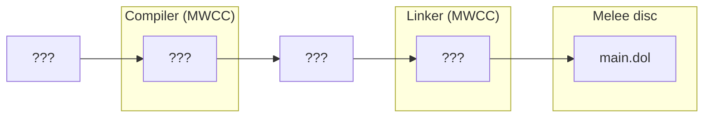
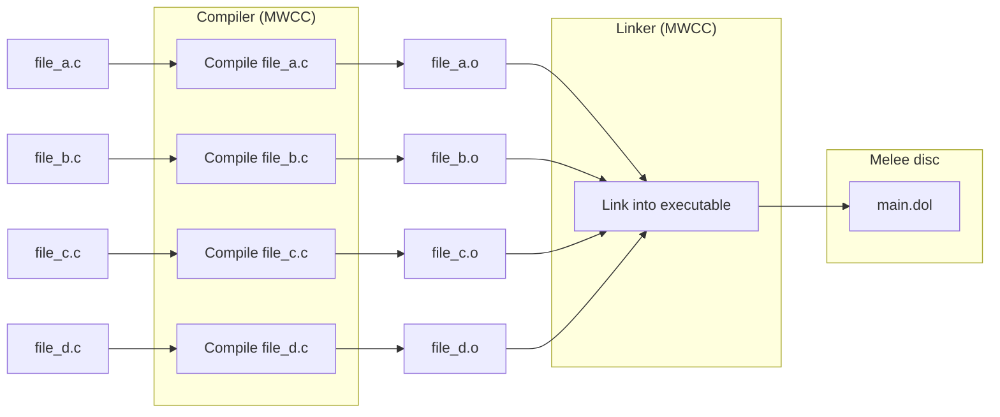
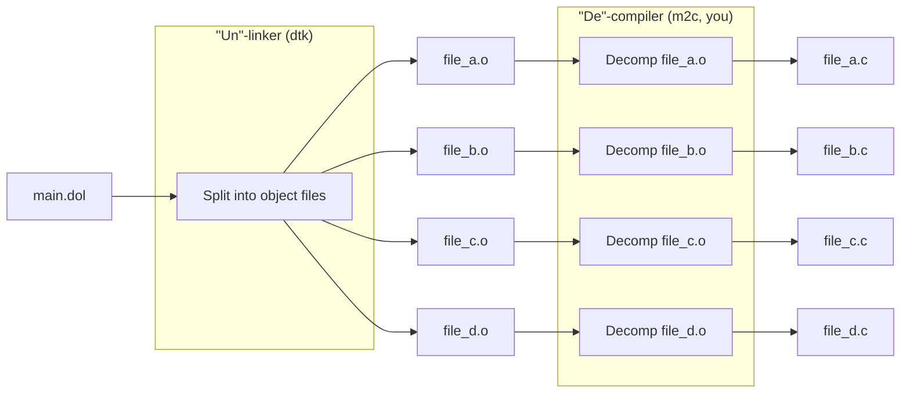

# Intro to Matching Decompilation

The goal of this document is to present a holistic overview of the decomp scene and how the process of decompilation works, hopefully allowing someone who has close to zero knowledge of decomp to quickly get up to speed and gain the confidence to start contributing to projects. It is complemented by the (currently WIP) decomp training repo. As always, reach out on the [Discord server](https://discord.gg/hKx3FJJgrV) if you have any questions or comments.

## What do I need to know to get into decomp?

Decompilation is somewhat unique in that it's more like a puzzle than a concrete "programming" problem; you don't necessarily have to have any experience in graphics programming or algorithms or game engine development to be effective at it (aside from perhaps being able to document the code well). However there *is* a nontrivial amount of baseline knowledge you need to at least be familiar with if you want to not burn out and wander off when the going gets tough. Namely this includes A. surface-level knowledge of C/C++ (i.e. pointers, functions, structs) and B. baseline knowledge of how the CPU works (primarily what assembly is, what are registers, what the stack is, etc.). Consider viewing any of the following materials or projects that strike your interest if you feel you have inadequate knowledge in the aforementioned fields:

- C resources
   - [Pong](https://youtu.be/m_jDyqcvaQU)
   - [Kilo text editor](https://viewsourcecode.org/snaptoken/kilo/index.html)
   - [A simple ray tracer](https://youtu.be/2BLRLuczykM)
- CPU knowledge resources
    - [Harvard CS50](https://www.youtube.com/watch?v=LfaMVlDaQ24) (lectures 0-5)
    - [Gameboy emulator guide](https://www.youtube.com/watch?v=e87qKixKFME&list=PLVxiWMqQvhg_yk4qy2cSC3457wZJga_e5&index=1) (hardcore but very informative, also consider joining the [emulator developers Discord server](https://discord.gg/emudev))
    - [Computer, Enhance!](https://www.computerenhance.com/p/table-of-contents) (paid but very high quality, do Part 1)

__TODO__: Not sure how useful this list is, as it's biased towards what I (fox) have personally found useful. Other members ought to contribute as well.

## What is "decomp?"

You, having found this document, likely already have a general idea of what decomp is and the games that have currently been "decompiled" fully. "Decompilation" is a subgenre of the broader field of reverse engineering with the primary goal of creating a *matching decomp*. Basically this means we want to make a functionally identical reconstruction of a game's source code from the machine code that the game shipped on that, when compiled with that game's *original compiler*, compiles into a byte-for-byte copy of the original game. 

Essentially, the concept of "decomp" formed from the desire to make proving equivalency in reverse engineering less reliant on our own judgement and tooling, which can lead to hard-to-find errors and edge cases, and instead find a way to make what could be considered "ground truth" measurements between our code and the game's. The most successful way this has currently been achieved, as demonstrated in decomps like SM64, Pokemon Emerald, or Mario Party 4, is to deduce, research, and utilize the tools and techniques that the original developers were most likely to have used, and then try to "match" the original executable as best we can.

The degree to which how this "matching" is done, or in other words how accurately we can retrace the developers' original steps, as well as if it's even possible to do so in the first place, can vary drastically depending on many factors such as:

- the CPU architecture
- the game's compiler
- the time period
- what flags the devs used on that compiler
- which language features the devs used
- how the program was structured
- whether the devs left certain debug information on the disc by accident
- whether a target game shares code with another game that's easier to decompile
- the goals of the main members of the decomp
- ...the list goes on. 

To give some examples from real projects:

- Compilers like [MWCC](/compilers/MWCC) for the Gamecube/Wii and [IDO](/compilers/ido) for the N64 generate assembly in a way that is very specific to how the code was written, or in other words, a series of 10,000 logically equivalent ways of writing the same thing may compile 10,000 different ways even with the same optimization level and other compiler flags. Some examples include:
    - Casts in specific places
    - The inline keyword and what specific parts of assembly come from inlines (which has large implications on the stack size in MWCC)
    - The const keyword (MWCC)
    - Whitespace! (IDO)
- By contrast, the Clang compiler for the Nintendo Switch is much better at discarding information that is irrelevant to the program's execution, and projects like the Breath of the Wild decomp have to worry a lot less about how the original developers may have written the code. They still match the assembly of each function exactly, but certain details like how the functions are placed in memory are different. [This page](https://botw.link/about) has a great writeup on that.
- Determining which compiler a game uses in and of itself can become its own ordeal (a game may even use multiple different compilers for different components!), and in the case of games before the late 2000s, also entails buying as many old CDs as possible and hoping it contains the exact compiler version that's desired. 
- Super Smash Bros. Melee has a fair bit of unused code that still got linked into the final game, namely a bytecode interpreter that's fairly large, that the members won't count as part of "completing" the project. 
- Mario Party 4 is compiled with no optimizations (-O0), a contributing factor as to why it became the first matched GC game
- Quite a few games accidentally release a version that contains partial or full debug *symbols* (discussed later), which reveal things to us like translation unit splits (more on that later), function arguments, and struct members without having to guess. Some GC/Wii examples include Mario Sunshine, Rock Band 3, Mario Galaxy, Pikmin 2, Metroid Prime, and TTYD. 
- Many seemingly unrelated first-party DS and Wii games such as Mario 64 DS, Animal Crossing: City Folk, and Skyward Sword all share a common engine, as detailed by Ninji in [this article](https://wuffs.org/blog/reversing-games-with-hashcat).

## The PowerPC Architecture

PowerPC (PPC) is an instruction set architecture (ISA) derived from the earlier architecture POWER that used to be used in computers and game consoles in the 90s and 2000s (notably in several Apple products, the Xbox 360, the PS3, and the GC/Wii/Wii U). Nowadays x86 and ARM are the predominant ISAs in terms of consumer hardware, though it doesn't take much effort to learn PowerPC specifically if you're already familiar with the concepts listed in the intro. Specifically, the GameCube and Wii use an embedded, 32-bit version of PowerPC on their CPUs. There are 32 registers for general purpose operations (GPRs, r0..r31) and 32 registers for floating point operations (FPRs, f0..f31). The size of the GPRs are 4 bytes on 32-bit and 8 bytes on 64-bit, while FPRs are 8 bytes on both types.

Relevant resources:

- [PowerPC User Instruction Set Architecture](https://files.decomp.dev/ppc_isa.pdf), which is useful for looking up what an opcode does. 
- [System V Application Binary Interface PowerPC Processor Supplement](http://refspecs.linux-foundation.org/elf/elfspec_ppc.pdf) and the [PowerPC Embedded Application Binary Interface (EABI): 32-Bit Implementation](https://www.nxp.com/docs/en/application-note/PPCEABI.pdf), which is useful for understanding what each register does. 
- [The PowerPC Compiler Writer’s Guide](https://files.decomp.dev/IBM_PPC_Compiler_Writer's_Guide-cwg.pdf), which is useful to understand specific compiler behavior like integer division.

## The main information

One of the most important things to be aware of to gain a clear mental picture as to how decompiling works is to understand how functions in C/C++ get compiled and how building a C/C++ program in general happens. 

### Functions

For starters, consider these two functions and the PowerPC disassembly it would compile to if you were to inspect a game's executable directly in Dolphin:


```c
int adder(int a, int b)
{
    return a + b;
}

int call_adder()
{
    return adder(7, 9);
}
```

```
# int adder(int a, int b)
802d8618    add r3, r3, r4
802d861c    blr
# int call_adder()
802d8620    mflr    r0
802d8624    li  r3, 0x7
802d8628    stw r0, 0x0004 (sp)
802d862c    li  r4, 0x9
802d8630    stwu    sp, -0x0008 (sp)
802d8634    bl  ->0x802d8618
802d8638    lwz r0, 0x000C (sp)
802d863c    addi    sp, sp 8
802d8640    mtlr    r0
802d8644    blr
```

Note that I've purposely compiled this to prevent auto inlining and make both functions appear discretely, with `adder` corresponding to the first two lines and `call_adder` being the rest. You'll see how auto inlining can "remove" where a function would be later. First I'll step through and explain each instruction individually, starting with where `call_adder()` starts, at the `mflr`:
- `802d8620    mflr    r0`
    - This stores the contents from the link register into r0. You'll see why the function has to do this in a second.
- `802d8624    li  r3, 0x7`
    - This loads 7 into r3, which corresponds to the first argument in `adder(7, 9)` and will be used by `adder` later. 
- `802d8628    stw r0, 0x0004 (sp)`
    - This relates to setting up the stack that's not relevant to discuss now.
- `802d862c    li  r4, 0x9`
    - This serves the same function as the previous `li`, loading the 9 into r4 to be used.
- `802d8630    stwu    sp, -0x0008 (sp)`
    - More irrelevant stack setup. Note that the `li` instructions and the next `bl` instruction that call `adder` with the 7 and 9 don't necessarily have to appear contiguously, and the compiler is allowed to interleave other operations between them as long as they're not dependent on each other.
- `802d8634    bl  ->0x802d8618`
    - This makes the CPU *branch* to specified address and start executing the opcodes from there, which in this case (`0x802d8618`), is the beginning of our `adder` function. It also overwrites the link register with the next instruction after itself, `802d8638    lwz r0, 0x000C (sp)`.
- `802d8618    add r3, r3, r4`
    - As you may be able to guess, this adds r3 and r4 together and stores the result in r3. From this instruction, we can deduce the following, which you can also verify on page 3-14 of the [System V ABI for PowerPC](http://refspecs.linux-foundation.org/elf/elfspec_ppc.pdf):
        - The first (non-float) argument to a function starts at r3, and goes until r10. For floats, it's f0-f8.
        - r3 will be used to return non-float values (r4 can also be used in conjunction with r3 to return a 64-bit value on a 32-bit processor). For floats, it's f1 only (float registers are always 64 bits).
- `802d861c    blr`
    - This makes the CPU branch to the address in the link register, which `blr` previously filled with the `lwz` op.
- `802d8638    lwz r0, 0x000C (sp)`
- `802d863c    addi    sp, sp 8`
    - The cleanup routine for the stack.
- `802d8640    mtlr    r0`
    - This loads the contents from r0 into the link register. We stored the contents of the link register at the beginning of the function, so the link register now points to whatever function elsewhere in the code called `call_adder`.
- `802d8644    blr`
    - This breaks to whatever function called `call_adder`, and ends execution of `call_adder`. From these last two instructions we can deduce the following:
        - A function will use `mflr` and `mtlr` if it has to call a function and modify the link register, which is why `adder` doesn't need to do so.
        - We can tell where functions start and stop without looking at the source code by looking between pairs of `blr` opcodes.

You likely won't fully grasp these concepts if you're still new to assembly and haven't done much decomp yet, which is fine; the main takeaway you should see here is that functions in C are simply an address in memory that a caller breaks to. 

### Compiling and linking

When we say that a C program gets "compiled" or invoke a compiler like [MWCC](/compilers/MWCC) or MSVC or Clang or [GCC](/compilers/GCC), there’s actually two processes happening: a compiler *and* a linker. It may be a bit fuzzy to you even if you have C experience if you've only ever invoked both stages at the same time or only use tools like CMake or Ninja, where the actual compilation command that gets executed is hidden from you by default. For example, let's say we have a typical C/C++ project that consists of two files named `file_a.c` and `file_b.c`, and we want to compile it into an executable with gcc:

```
gcc -o out file_a.c file_b.c
```

This will do what you expect, outputting an executable named `out`. If we wanted to invoke the compiling and linking stages separately, we would do this:

```
gcc -c file_a.c
gcc -c file_b.c
gcc -o out file_a.o file_b.o
```

The first two commands use the `-c` flag to invoke just the compiler and output what are referred to as *object files* with a default name of `file_a.o`, `file_b.o`. We then pass both of these to gcc with no special arguments and it will implicitly see that there are no source files to compile and only run the linker. From this it's important to note these observations:
- Each source C/C++ file that gets passed in as an argument to the compiler is called a translation unit. Only the file itself is counted as a TU, and any i.e. header files `#include`d in the C file are a part of that same TU.
- Note that it's only the *linker* that needs to be able to see "everything" to produce an executable, not the *compiler*. The compiler can work on multiple TUs in parallel, because compilation and the resulting object file only concerns the content of each individual TU. 
- The machine code in object files are for the most part the same as what appears in the finalized executable (with a large exception discussed later), with the key differences arising from the limitation that each object file exists independently from each other.

To make the last point more clear, here's an example with the same functions `adder` and `call_adder` from above, but we're looking at the disassembly of the machine code from the resulting *object files*:

```c
int adder(int a, int b)
{
    return a + b;
}

int call_adder()
{
    return adder(7, 9);
}
```

```
# int adder(int a, int b)
00    add   r3, r3, r4
04    blr
# int call_adder()
08    mflr    r0
0C    li  r3, 0x7
10    stw r0, 0x0004 (sp)
14    li  r4, 0x9
18    stwu    sp, -0x0008 (sp)
1C    bl    adder
20    lwz   r0, 0x000C (sp)
24    addi    sp, sp 8
28    mtlr    r0
2C    blr
```
(There is more data in the object file than just machine code, for now that's all that's being shown)

It's identical to the code in the executable, with only two differences:
1. The addresses start at a relative offset to the object file (`adder` and `call_adder` being the first two functions defined) rather than offset to an actual memory address. This is because the compiler can't predict the size of every other TU ahead of time, and it's the linker's job to glue all of the TUs together and change these to finalized addresses.
2. The `bl` instruction has been replaced with what's referred to as a *symbol* to a function called `adder`. This is again because of the above condition. In this case since the functions share the same TU you could argue something like "offset 0" instead of the name specifically would work, but remember the compiler typically would not emit this had I not disabled inlining here. If I were to compile this with inlining, the functions would look like this:

```
# int adder(int a, int b)
00    add   r3, r3, r4
04    blr
# int call_adder()
08    li    r3, 0x10
0C    blr
```

`adder` doesn't change, but the nine instructions involved in setting up the stack and passing arguments to `adder` in `call_adder` have now become a single load into the return register! (0x10 being 16, the result of 7+9 already calculated). You're probably wondering why the code for `adder` is even still generating now that the `bl    adder` has been optimized away, and if you've been paying very acute attention, you probably already know the answer. It's because since only the *linker* gets to see all the object files, the *compiler* can't assume `adder` isn't called anywhere else! If you were to run this object file through the linker and inspect the address where `adder` would be in the compiled executable, however, you'd see that it's gone:

```
# int call_adder()
802d8618    li    r3, 0x10
802d861c    blr
```
and that's because the linker actually does gain the ability to delete a function in the linking stage if it sees that no object file actually calls it. Some other relevant tidbits:
- If `adder` was in a different TU from `call_adder`, then `call_adder` would generate exactly how it does in the first version with auto inlining disabled, because the compiler now can't see what `adder` is when compiling `call_adder`.
- If I had used the `static` keyword on `adder`, which (when used on a function) means you're telling the compiler that no other TU uses that function, then the compiler would have actually been able to delete the machine code in the object file for that function *before* the linking stage. This is why you get a *linker* error when calling a function from another TU that has the `static` keyword instead of a *compiler* error. The compilation stage can't know there's a problem until it gets to linking!
- The `inline` keyword has gained less and less relevance to compilers as they get "smarter" with their optimizations, with compilers even in the 2000s like MWCC often making the choice whether to inline a function or not regardless of the keyword's presence. It still has a large influence in MWCC and the codegen in most games, however, and shouldn't be overlooked when working on a file.

## Aside on types of executables

It's important to briefly note that there are multiple sort of "ways" a typical program can load code into RAM. The simplest way is to gather all the object files together and turn them into a single executable that the OS will load once at the beginning and leave there until the program closes. This is notably how Super Smash Bros. Melee is structured, for instance; the only file that objdiff needs if you've ever built the game from its [decomp repo](https://github.com/doldecomp/melee) is `main.dol`. However, it's common for a game's code to be compartamentalized across multiple files besides the main executable, which are typically called *relocatable object files*. Basically you can choose to just not run the linker on certain object files when making the executable and instead, when the game is being run, have the OS perform a kind of "linking" on demand that allows you to load and unload the related code whenever you want. You may be familiar with DLL files, the Windows equivalent of a REL, and if you think about what DLL stands for, "dynamically linked library," it's pretty much just that. The two main reasons for doing this include:

- Developer convenience. If you've ever used a library like SDL, Qt, or GLEW, you typically don't compile the source code of the libraries every time you rebuild; instead (if you're on Windows) you download a few DLL files and put them in the same directory as your code, and when the OS opens your program, it automatically also loads those DLLs. 
- Space. The GC and Wii only have 24 and 88 MB of RAM respectively, and a game's total code footprint can take a sizeable chunk of this. So if a game needs as much RAM as possible, it would be best to only load what code is actually being used. This is notably true for games like Brawl and Mario Kart Wii, where every fighter and stage are contained in their own REL. 


## The decomp process

Now we can finally bring it around and talk about how the decompilation process works. To explain it visually (using Melee as an example) basically, we have this:



and we want to end up with this:



and in order to do that, we do this:



So we have the executable and the compiler/linker, and we want to write C code and run it through the original compiler that the HAL Laboratory devs used to produce more or less the same object files that get linked by the original linker into a bit-for-bit recreation of the executable.

Our first step would be to "undo" the linking step and produce ad hoc object files that are *similar* to what the developers had, but as explained throughout the document, we can't losslessly restore what the original objects might have looked like from the executable alone. Primarily this process involves identifying *splits* where one object file begins and another ends, creating *symbols* for every function and global variable, and changing opcodes that reference constant addresses like the `bl  ->0x802d8618` back into a label. This is a bit of work depending on the compiler (especially if you don't have debug symbols or a similar game's code to work off of), but with PowerPC and Metrowerks, it isn't impossible. It's possible to programmatically analyze an executable of this type and guess where splits, functions, and global variables are with a high degree of confidence, which is exactly what the program [dtk](https://github.com/encounter/decomp-toolkit) does. Some other asides on this topic:
- One such way splits can be detected is that whenever you write `x = 0.0f` or `y = 1.0f` in a TU, that floating point value has to get saved in the object file somewhere. A very fortunate aspect of the Metrowerks linker is that if it encounters multiple object files that have, say, 0.0f or 1.0f defined in them, it doesn't try to remove, or *deduplicate* these extra values and instead just packs them together as-is, allowing us to identify where a TU likely starts by looking for each 0.0f or 1.0f.
- I mentioned in the functions section how `adder` can only get inlined into `call_adder()` if both were part of the same TU. This is because typically it's not the linker's role to perform optimizations, but if you were to turn on what is called *link-time optimization* on a modern compiler, heuristics like inlining only being an inner-TU operation and object files being similar to the final executable become false. It suddenly becomes massively harder to approach a decomp with this enabled, and this is why decompiling the latest version 1.6.0 of Breath of the Wild, for instance, is considered [a lost cause](https://botw.link/about#why-not-decompile-160).

The next step, which is where we are today, is to produce C code that compiles into a matching copy of these object files. It is arguably the most difficult part of completing a decomp project due to the sheer amount of code that goes into a game and the time it takes to make sure functions match exactly. It's one of the reasons this guide and sites like decomp.me exist: to make it easy for many people to collaboratively take on this problem. 

__TODO__: Information on tooling may be better to include in a foreward in the training repo?

## How to decomp

Your biggest ally when it comes to completing a game's decomp besides the general community is going to be the tooling built by talented individuals in that community around that game/platform. You've already learned about one such example with dtk, which deals with the splitting and symbols stage, and you've probably at least seen decomp.me, which deals with compiling C code and comparing the resulting object file with the one to match. I'll briefly mention some other relevant tools before going into detail on [decomp.me](https://decomp.me):
- [m2c](https://github.com/matt-kempster/m2c)
    - The C decompiler that decomp.me runs behind the scenes when you first create a scratch or hit the "Decompile" button in decomp.me. It supports compilers for both the MIPS architecture (used by the N64) and the PowerPC architecture.
- [objdiff](https://github.com/encounter/objdiff)
    - A UI and CLI tool that allows the quick comparison of symbols, instructions, and other data sections between two object files, basically a more complete version of the righthand UI from decomp.me.
- [dtk-template](https://github.com/encounter/dtk-template)
    - A convenient project workflow for starting a Wii/GC decomp that primarily uses dtk, objdiff, and ninja. The Melee repo is one such project that uses this.
- [Ghidra](https://github.com/NationalSecurityAgency/ghidra) and [IDA](https://hex-rays.com/)
    - Two IDE-like tools for reverse engineering, used in a fair bit of decomps.
